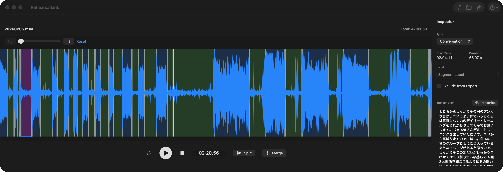
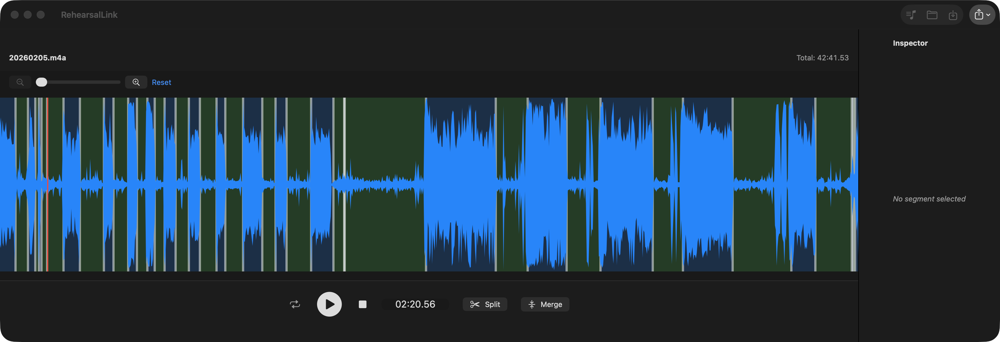
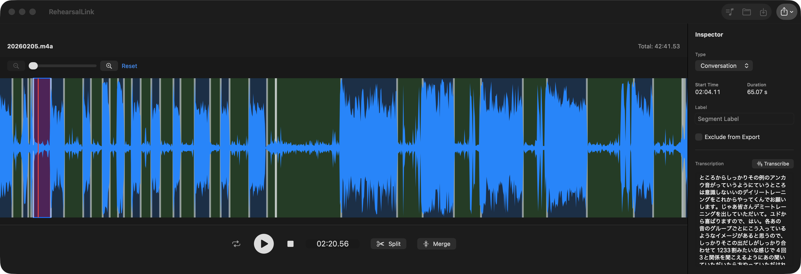
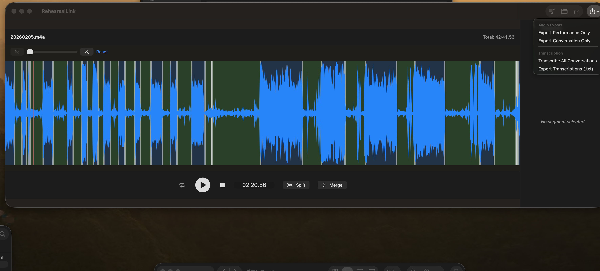

# RehearsalLink ユーザーガイド

RehearsalLinkは、リハーサル録音などの長い音声ファイルを効率的に整理、文字起こし、そして必要な部分だけを書き出すためのツールです。

## 1. 音声ファイルの読み込み

アプリを起動したら、以下のいずれかの方法で音声ファイルを読み込みます。

*   **ドラッグ＆ドロップ**: 音声ファイルをウィンドウに直接ドラッグ＆ドロップします。
*   **ツールバー**: 「Open Audio」ボタンをクリックしてファイルを選択します。
*   **プロジェクトの読み込み**: 以前保存した `.rlink` プロジェクトファイルを開くには「Open Project」を使用します。

## 2. 波形操作とナビゲーション

読み込まれた音声は中央に波形として表示されます。

*   **再生/一時停止**: 中央の大きな再生ボタン、またはスペースキーで操作します。
*   **停止**: 停止ボタンを押すと、再生を停止します（現在の再生位置は維持されます）。
*   **シーク**: 波形エリアをクリックすることで、任意の場所に再生ヘッド（赤い線）を移動できます。
*   **ズーム**: 波形上部のスライダー、または「+ / -」ボタンで波形を拡大・縮小できます。拡大中は再生ヘッドが常に画面中央に来るように自動スクロールされます。

## 3. セグメントの編集

音声は「セグメント」という単位で管理されます。アプリが自動的に無音部分で分割しますが、手動で調整も可能です。

*   **分割 (Split)**: 再生ヘッドの位置でセグメントを2つに分けます。
*   **結合 (Merge)**: 選択しているセグメントを、次のセグメントと結合します。
*   **境界の調整**: セグメント間の白い境界線をドラッグすることで、分割位置を微調整できます。

## 4. インスペクタ（詳細設定）

右側のインスペクタパネルでは、選択したセグメントの詳細情報を編集できます。

*   **タイプ (Type)**: 
    *   **Performance**: 演奏部分。波形上で青色で表示されます。
    *   **Conversation**: 会話部分。波形上で緑色で表示されます。
    *   **Silence**: 無音部分。波形上で薄い灰色で表示されます。
*   **ラベル**: セグメントに名前（「曲名」や「MC」など）を付けられます。
*   **エクスポート除外**: 「Exclude from Export」にチェックを入れると、そのセグメントは書き出し対象から外れます。除外されたセグメントは波形上で暗い灰色で表示されます。

## 5. 文字起こし (Transcription)

タイプが「Conversation」に設定されているセグメントは、AIによる文字起こしが可能です。

*   **個別文字起こし**: インスペクタの「Transcribe」ボタンを押します。
*   **一括文字起こし**: ツールバーの書き出しメニューから「Transcribe All Conversations」を選択します。
*   **テキスト編集**: 生成されたテキストは自由に修正でき、プロジェクト保存時に反映されます。

## 6. 保存と書き出し (Export)

*   **プロジェクト保存**: 「Save」ボタンで、編集状態（分割位置や文字起こしテキスト）を `.rlink` ファイルとして保存します。
*   **音声書き出し**: ツールバーの「Export」メニューから、用途に合わせて書き出しを行います。
    *   **Performance Only**: 演奏部分のみを連結して書き出します。
    *   **Conversation Only**: 会話部分のみを連結して書き出します。
    *   **Export Transcriptions**: 全ての文字起こしテキストを `.txt` ファイルとして保存します。