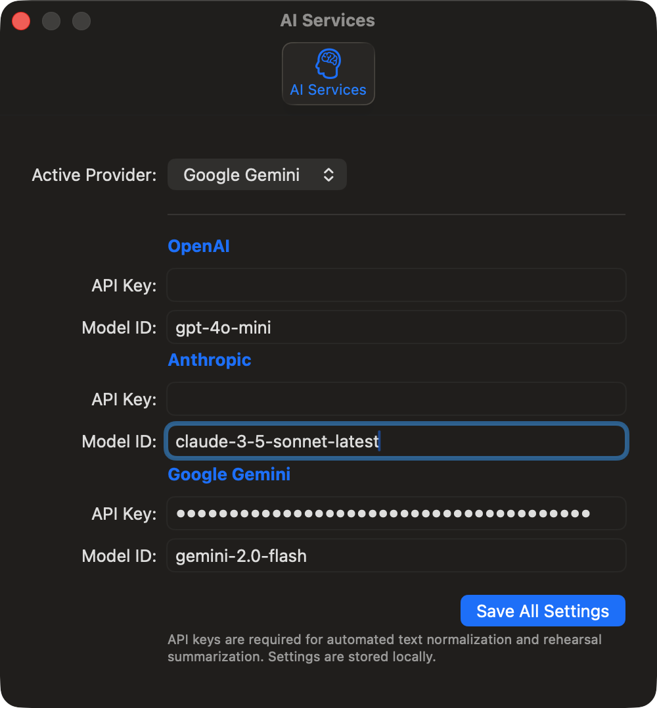

# RehearsalLink User Guide

RehearsalLinkは、リハーサル録音などの長い音声ファイルを効率的に整理、文字起こし、そして要約するためのmacOSアプリケーションです。
最新のAI技術を活用して、長時間の録音から「演奏」と「会話」を自動的に識別し、必要な情報だけを抽出することができます。

## 1. 画面構成

RehearsalLinkの画面は、大きく3つのエリアに分かれています。

1.  **Sidebar (左側)**: ファイルのインポート、プロジェクト管理、AI処理機能、エクスポート機能など、アプリの主要なアクションが集約されています。
2.  **Detail Area (中央)**: 音声波形の表示、再生コントロール、セグメントの編集を行うメインの作業エリアです。
3.  **Inspector (右側)**: 選択したセグメントの詳細情報の確認や編集を行います。画面右上のアイコンまたはメニューから表示/非表示を切り替えられます。

## 2. クイックスタート

### 音声の読み込み
アプリを起動し、Sidebarの **"Current Session"** または **"Library"** セクションを使用します。
*   **Import Audio...**: 新しい音声ファイル（.m4a, .mp3, .wavなど）を読み込みます。ファイルをウィンドウにドラッグ＆ドロップすることでも読み込めます。
*   **Open Project...**: 以前保存した `.rlink` プロジェクトファイルを開きます。

### 基本操作
音声読み込み後、自動的に解析が行われ、波形が表示されます。
*   **再生/一時停止**: スペースキー、または画面下部の再生ボタン。
*   **ズーム**: 波形上部のスライダー、または `Cmd` + `+` / `-` で波形を拡大縮小できます。
*   **セグメント選択**: 波形上の青（演奏）や緑（会話）のブロックをクリックすると選択状態になり、Inspectorに詳細が表示されます。

## 3. 詳細機能: Sidebar

Sidebarにはアプリの全機能がセクションごとに整理されています。

### Library
プロジェクトの読み込み・保存を行います。
*   **Save Project**: 現在の編集状態（分割位置、文字起こし、要約など）を保存します。こまめな保存をお勧めします。

### Processing (AI & Tools)
音声データの加工やAI分析を行う強力なツール群です。

*   **Normalize Audio**: 音声全体の音量を均一化し、聞きやすくします。録音レベルが低い場合に有効です。
*   **Batch Transcribe**: すべての「会話（Conversation）」セグメントを一括で文字起こしします。
*   **Generate Summary**: AIを使用して、リハーサル全体の内容（演奏曲目や会話の要点）をまとめた要約を生成します。
*   **AI Settings**: AI機能を使用するためのAPIキー設定を行います（詳細は後述）。

### Export
編集結果をファイルとして書き出します。
*   **Export Performance**: 「演奏」部分のみを結合して音声ファイル(.m4a)として書き出します。
*   **Export Conversation**: 「会話」部分のみを書き出します。
*   **Export Text**: 文字起こしされたテキストと要約をテキストファイルとして保存します。

## 4. 詳細機能: Waveform & Playback

波形エリアでは直感的な編集が可能です。

*   **セグメント分割 (Split)**: 再生ヘッド（赤い線）の位置で `Split` ボタンを押すか `Cmd+B` で、セグメントを分割します。
*   **結合 (Merge)**: 選択中のセグメントと次のセグメントを結合します。
*   **境界調整**: セグメント間の白い線をドラッグして、区切り位置を微調整できます。
*   **ループ再生**: 選択したセグメントのみを繰り返し再生します（トランスポートバーのループアイコン）。

## 5. 詳細機能: Inspector

選択したセグメントの属性を編集します。

*   **Label**: 「曲名」や「話題」などを入力します。
*   **Type**:
    *   **Performance (青)**: 演奏部分。
    *   **Conversation (緑)**: 会話部分。文字起こしの対象になります。
    *   **Silence (灰)**: 無音部分。
*   **Transcribe**: ボタンを押すと、そのセグメント単体の文字起こしを実行します。
*   **Exclude from Export**: チェックを入れると、音声書き出し時にこのセグメントがスキップされます。

## 6. AI機能の設定と使用方法

RehearsalLinkは、OpenAI, Anthropic, Google Gemini などの外部AIサービスと連携して、高度な文字起こし正規化や要約機能を提供します。

### AI設定 (AI Settings)
Sidebarの **"AI Settings"** をクリックして設定画面を開きます。

*(注: 設定画面では使用するプロバイダを選択し、取得したAPIキーを入力して「Save All Settings」で保存します)*

1.  **Active Provider**: 使用するAIプロバイダを選択します（例: `OpenAI`, `Anthropic`, `Gemini`）。
2.  **API Key**: 選択したプロバイダのAPIキーを入力します。キーはローカルに安全に保存されます。
3.  **Model ID**: 使用するモデルIDを指定します（空欄の場合はデフォルトが使用されます）。
    *   OpenAI default: `gpt-4o-mini`
    *   Anthropic default: `claude-3-5-sonnet-latest`
    *   Gemini default: `gemini-2.0-flash-exp`

### AI機能の活用
*   **文字起こし (Transcription)**:
    OS標準の音声認識で粗いテキストを取得した後、AIを使用して「読みやすい形」に修正・要約させることができます。
*   **要約 (Summary)**:
    リハーサル全体の流れをAIが分析し、「どの曲を練習したか」「どんな課題が出たか」などのサマリーを生成します。これはバンドメンバーへの共有用メモとして最適です。

---
**Note**: AI機能の使用にはインターネット接続が必要です。また、各プロバイダのAPI利用料金が発生する場合があります。
